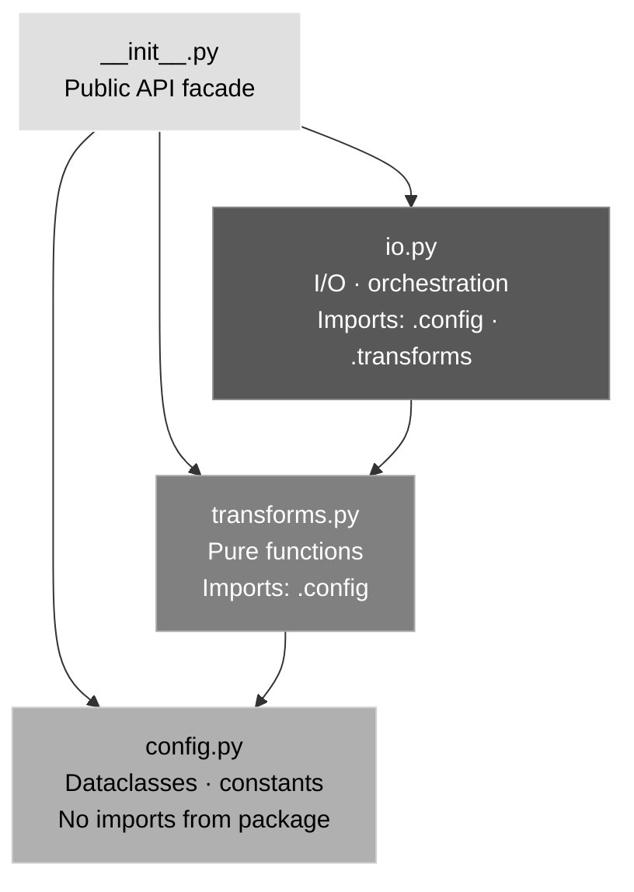

# Architecture

Current layout and responsibilities of the `src/` tree. Update this document when modules are added, renamed, or have their responsibilities changed.

---

## Source Layout

```
src/
  <package>/
    __init__.py       # Re-exports the full public API — no logic
    config.py         # Dataclasses, constants, enums — no I/O
    transforms.py     # Pure data transformation functions
    io.py             # I/O and pipeline orchestration
    py.typed          # PEP 561 marker

scripts/
  run_example.py      # Usage examples

tests/
  test_config.py      # Unit — config dataclass
  test_transforms.py  # Unit — transformation functions
  test_io.py          # Unit — I/O pipeline
```

---

## Module Dependencies



**Rule:** `config` ← `transforms` ← `io`. No upward or lateral imports. `__init__` re-exports all three but adds no logic.

---

## Conventions

| Convention       | Rule                                                                                               |
| ---------------- | -------------------------------------------------------------------------------------------------- |
| Naming           | Do not shadow Python builtins (`filter`, `map`, `list`, `id`, etc.)                                |
| Type hints       | Annotate all function signatures and dataclass fields                                              |
| Boolean checks   | `if flag:` not `if flag == True:`                                                                  |
| String splitting | Always `split(sep, maxsplit=1)` when unpacking into two variables                                  |
| Demo code        | Scripts go in `scripts/`, not inside library modules                                               |
| Test output      | Suppress `print()` per-test with `@patch('builtins.print')` — never redirect `sys.stdout` globally |
| Test assertions  | `assertIsInstance` not `assertTrue(isinstance(...))`                                               |

See `docs/python-guide/` for full rationale and examples.

---

## Public API

Import from the package root:

```python
from <package> import MyClass, my_function
```

Direct sub-module imports are valid for internal use:

```python
from <package>.config import MyConfig
from <package>.transforms import my_transform
from <package>.io import load
```
