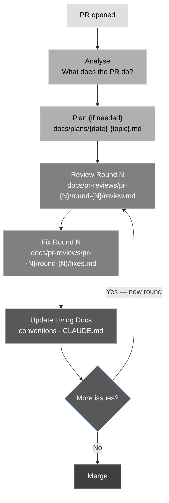

# PR Review Guide

This document describes the review workflow used in this project. Every non-trivial PR produces a consistent set of artefacts so that decisions, findings, and fixes are traceable across multiple rounds of review.

______________________________________________________________________

## The Workflow

A single PR may go through multiple review → fix cycles. Each cycle is one **round**. Rounds are numbered sequentially. Reviewers and fixers can change between rounds.



______________________________________________________________________

## Folder Structure

```
docs/pr-reviews/
  pr-{N}/
    round-1/
      review.md   — analysis (round 1 only) + findings for this round
      fixes.md    — fixes applied in response to this round's findings
    round-2/
      review.md   — findings for this round (no repeat analysis needed)
      fixes.md    — fixes applied in response to this round's findings
    ...
```

**Rules:**

- The PR folder is named by **PR number** (`pr-5`), never by branch name.
- Each round gets its own subfolder (`round-1`, `round-2`, …).
- The **analysis** section (what the PR does) belongs in `round-1/review.md` only. Later rounds skip it and go straight to findings.
- Reviewer and fixer are tracked **per round** in the round's frontmatter, not at the PR level.

______________________________________________________________________

## Frontmatter

### review.md

```yaml
---
pr: 5
branch: feat/my-feature
round: 1
title: "Short description of the PR"
author: githubuser
reviewer: Reviewer Name
date: 2026-01-01
commits_reviewed: abc1234..def5678 # git range that was reviewed this round
status: open | resolved
---
```

`commits_reviewed` is the exact range passed to `git diff` or `git log` for this round. For round 1 it is typically the full PR range (`first_commit..last_pr_commit`). For later rounds it covers only commits added since the previous review.

`status: resolved` means all findings from this round were addressed.

### fixes.md

```yaml
---
pr: 5
branch: feat/my-feature
round: 1
fixes_by: Fixer Name
date: 2026-01-01
fix_commits: abc1234..def5678 # git range of commits that implement the fixes
---
```

`fix_commits` is the range of commits authored by the fixer in response to this round's findings. If fixes were applied as working-tree changes committed in a single batch, it may be a single SHA.

Do not link to living docs (e.g. `docs/architecture/modules.md`) from fixes.md — they will drift. If a fix updated a living doc, record the commit SHA where that update landed instead: e.g. `Architecture updated at 3990665`.

For later rounds, only `round`, `fixes_by`, `date`, and `fix_commits` change.

______________________________________________________________________

## Artefacts Summary

| Artefact | Path | Produced by | When |
| ----------------------- | -------------------------------------------- | ----------- | ----------------------- |
| Analysis + findings | `docs/pr-reviews/pr-{N}/round-1/review.md` | Reviewer | Before any fixes |
| Findings (later rounds) | `docs/pr-reviews/pr-{N}/round-{R}/review.md` | Reviewer | After each fix round |
| Fixes | `docs/pr-reviews/pr-{N}/round-{R}/fixes.md` | Fixer | After each review round |
| Plan | `docs/plans/{date}-{topic}.md` | Anyone | Before implementation |
| Living docs | (updated in place) | Fixer | After fixes applied |

______________________________________________________________________

## Round 1 — Analysis + First Review

**File:** `docs/pr-reviews/pr-{N}/round-1/review.md`

Round 1 is the only round that includes a full **analysis** section. Subsequent rounds skip the analysis and go straight to findings.

### Analysis section — include:

- One-paragraph summary of what the PR does
- Mermaid diagram of what changed (files, data flow, module relationships)
- Notable design decisions

### Findings section — open with a summary table:

| Severity | # | Finding |
|---|---|---|
| Critical | 1 | Short title |
| Important | 2 | Short title |
| Minor | 3 | Short title |

Then for each finding include:

- A short numbered title
- The file and line (or snippet)
- What is wrong and why it matters
- How to fix it (if not obvious)
- Severity: **Critical**, **Important**, or **Minor**

| Severity | Meaning |
| --------- | ------------------------------------------------------------------- |
| Critical | Will crash or corrupt data in production |
| Important | Bug, wrong behaviour, or violation of a living doc convention |
| Minor | Hygiene — no functional impact, creates future maintenance friction |

### What is not a finding:

- Pre-existing issues not touched by this PR
- Things a linter or type checker catches automatically
- Style preferences not backed by `docs/python-guide/`

______________________________________________________________________

## Fix Rounds

**File:** `docs/pr-reviews/pr-{N}/round-{R}/fixes.md`

Produced by the fixer after each review round. Records every change made in response to that round's findings.

Structure:

**Part A — Committed fixes:** table of commits — short SHA, findings addressed, description. Use `diff` blocks for non-obvious code changes (lines prefixed with `-` for removed, `+` for added).

**Part B — Working-tree fixes:** changes applied without a dedicated commit (minor guards, comments, newlines). Same format — use `diff` blocks where applicable.

**Restructure History** (if applicable): added when module boundaries, file locations, or public APIs changed during this round.

**Final State** (last fix round only): metrics table showing net change from original to end state.

| Metric | Before | After |
| -------------- | ------ | ----- |
| Source modules | … | … |
| Tests | … | … |
| Open findings | … | 0 |

Example diff block:

````markdown
```diff
-def foo(x: int | None = None) -> int:
-    if x is None:
-        raise ValueError("x required")
+def foo(x: int) -> int:
     return x * 2
```
````

______________________________________________________________________

## Later Review Rounds

**File:** `docs/pr-reviews/pr-{N}/round-{R}/review.md` (R ≥ 2)

Same structure as round 1 but **without the analysis section**. The frontmatter `round` field increments. The reviewer may differ from round 1.

Only findings introduced or uncovered since the last fix round are listed — do not repeat resolved findings.

______________________________________________________________________

## Plan

**File:** `docs/plans/{YYYY-MM-DD}-{topic}.md`

Written before implementation begins. Plans are never deleted — they record how decisions were made.

Include:

- Goal and scope
- Ordered task list with explicit steps and verification commands
- Risk notes (edge cases, breakage potential, rollback strategy)
- Reference to relevant living docs

______________________________________________________________________

## Updating Living Docs

After every fix round, update as needed:

| Document | Update when |
| ------------------------------ | -------------------------------------------------------------- |
| `docs/python-guide/` | New project-wide coding convention established during review |
| `CLAUDE.md` | Anything that changes how to navigate or work in the repo |

**Rule:** if you had to look something up during review that wasn't in any living doc, add it before closing the round.

______________________________________________________________________

## Commits

Group changes into logical commits:

```
feat/fix/refactor: <what changed>    ← code changes
docs: <what was documented>          ← artefacts + living doc updates
```

Each commit message should be self-contained — a future reader running `git log` should understand what happened without reading the diff.

______________________________________________________________________

## Quick Checklist — Per Round

### Review round

- [ ] `docs/pr-reviews/pr-{N}/round-{R}/review.md` written (analysis in round 1 only)
- [ ] All findings classified by severity
- [ ] Findings reference specific files and lines

### Fix round

- [ ] `docs/pr-reviews/pr-{N}/round-{R}/fixes.md` written
- [ ] Every finding from this round addressed or explicitly deferred with reason
- [ ] Living docs updated where applicable
- [ ] Changes committed with clear messages

### Before merge (final round only)

- [ ] All Critical and Important findings resolved across all rounds
- [ ] `docs/python-guide/` current
- [ ] `CLAUDE.md` current
